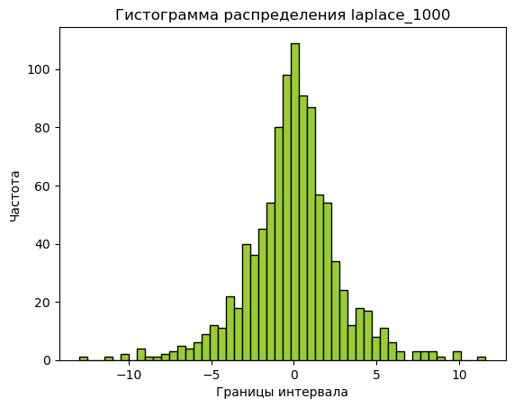

# Лабораторная работа № 1

# Цель

1. Ознакомление со средой имитационного моделирования на языке программирования
Python (или любой другой язык по желанию студента).
2. Изучить основные типы данных, команды ввода и вывода данных, статистические
методы работы с данными.

# Задание

#### Задание 1 

Построить матрицу c количеством строк 10 и столбцов 2, переменные
заполняются случайными числами с равномерным распределением.
Полученные сгенерированные случайные числа представить на графике в
виде точек.

#### Задание 2 

Сгенерировать 1000 случайных чисел с любым известным распределением
и построить их гистограмму, математическое ожидание, дисперсию.

#### Задание 3 

Сгенерировать случайную точку, равномерно распределенную в квадрате
со стороной а. 

# Выполнение работы.

Добавляю библиотеку numpy, которая понадобиться для разничных вычислений в данной лабораторной работе и библиотеку pyplot из matplotlib для создания и отображения графиков.


```python
import numpy as np
import matplotlib.pyplot as plt
```

# Задание 1

Из библиотеки numpy использую функцию random.uniform, чтобы сгенерировать и записать в матрицу с равномерным распределием.
random - отвечает за генерирование случайных значений
uniform - как раз таки задает тип распределения


```python
matrix = np.random.uniform(size=(10, 2))
print(matrix)
```

    [[0.04424243 0.24022077]
     [0.78286758 0.86635291]
     [0.75581516 0.32740264]
     [0.97257299 0.28932996]
     [0.674735   0.09844537]
     [0.36682006 0.46194301]
     [0.67138328 0.00723221]
     [0.95718727 0.56434454]
     [0.87620169 0.41674476]
     [0.12531726 0.75331469]]
    

В нашей матрице в превом столбце записаны значения х а во втором значения у для сгенерированных 10 точек.
Поэтому для того чтобы отобразить их на графике на необходимо отделить эти значения следующим образом:


```python
print(matrix[:, 0])
```

    [0.04424243 0.78286758 0.75581516 0.97257299 0.674735   0.36682006
     0.67138328 0.95718727 0.87620169 0.12531726]
    

: - все значения по строке

0 - первый столбец, так как нумерация в python начинается с 0

Дальше создаю график при помощи функций matplotlib.pyplot

1. figure - задает разме окна графика
2. plot - рисует точки на графике с координатами х и у, так как задан парметр "о"
3. title - пишет название графика
4. xlabel, ylabel - подписывает оси x и y соответственно
5. legend - создает отдельное очко с названиями функций указанных на графике, для этого нужно добавить при создании функции парметр label


```python
plt.figure(dpi=100) 

plt.plot(matrix[:, 0], matrix[:, 1], 'o', label = 'Случайные точки')
plt.title('Задание № 1')
plt.xlabel('Значения по x')
plt.ylabel('Значения по y')
plt.legend()
```


    <matplotlib.legend.Legend at 0x26a62ce1c10>


    

    


# Задание 2
Генерирую 1000 случайных точек с распределением Лапласа.


```python
laplace_1000 = np.random.laplace(0, 2, size=1000)
```

Считаю математическое ожидание и дисперсию полученных точек


```python
print('Mean for laplace_1000:', np.mean(laplace_1000))
print('Var for laplace_1000:', np.var(laplace_1000))
```

    Mean for laplace_1000: -0.05060385497457248
    Var for laplace_1000: 7.701698325173986
    

Создаю гистограмму при помощи функции hist из matplotlib.pyplot и вывожу график при помощи show


```python
# Построить базовую гистограмму
plt.hist(laplace_1000, bins=50, color='yellowgreen', edgecolor='black')

# Добавить метки и заголовок
plt.xlabel('Границы интервала')
plt.ylabel('Частота')
plt.title('Гистограмма распределения laplace_1000')

# Вывести график
plt.show()
```


    

    


# Задание 3

Задаю длину стороне квадрата случайным чмсло от 1 до 5
Аналогично первому заданию генерирую случайные равномернораспределенные значения х и у для точки.

Через функцию axis задаю размер осей графика, чтобы график предлставлял из себя квадрат.
Остальные данные ввожу аналогично предыдущим задачам.


```python
a = np.random.randint(1, 5)
point = np.random.uniform(size=(1, 2))
plt.axis([0, a , 0, a])

plt.plot(point[:, 0], point[:, 1], 'o', label = 'Случайная точка')
plt.xlabel('Сторона квадрата')
plt.ylabel('Сторона квадрата')
plt.title('Случайный квадрат')
plt.grid()
plt.legend()
```


    <matplotlib.legend.Legend at 0x26a6303d250>


    

    


Для того чтобы удостовериться, что всё работает хорошо запускаю программу ещё раз и сравниваю два попучившихся графика.


```python
a = np.random.randint(1, 5)
point = np.random.uniform(size=(1, 2))
plt.axis([0, a , 0, a])

plt.plot(point[:, 0], point[:, 1], 'o', label = 'Случайная точка')
plt.xlabel('Сторона квадрата')
plt.ylabel('Сторона квадрата')
plt.title('Случайный квадрат')
plt.grid()
plt.legend()
```


    <matplotlib.legend.Legend at 0x26a6273bf50>


    

    


```python

```

# Вывод.

В процессе выполения работы я познакомилась с рабочей средой для python - jupyter notebook, изучила основные типы данных, команды для ввода и вывода данных, а также статистические
методы работы с данными. Научилась задавать рандомные значения с разными рапределениями, работать с матрицей и отоббражать данные на графиках и гистограммах.
