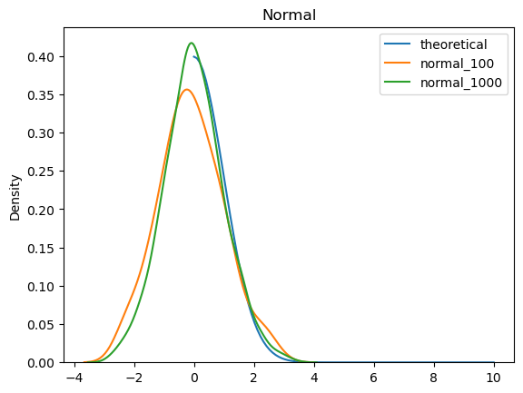
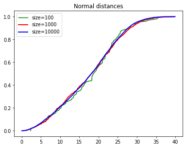

# Лабораторная работа № 2

# Цель

Ознакомление с методами оценки статических характеристик.

# Задание

## Задание 1. 

Сгенерировать выборку случайных чисел размером 100 и 1000 для двух
распределений – экспоненциального и нормального. Для созданных выборок сделать
следующее:
1. Посчитать выборочное среднее и дисперсию, сравнить с математическим
ожиданием соответствующих распределений;
2. Посчитать 0.5 и 0.99 квантили, сравнить с соответствующими теоретическими
значениями;
3. Построить гистограмму распределения;
4. Построить функцию распределения случайной величины на основе выборки (на
одном графике показать функции распределения, полученные из выборок
разного размера и теоретическую);
5. Построить плотность распределения случайной величины на основе выборки (на
одном графике показать плотности распределения, полученные из выборок
разного размера и теоретическую).

**В итоге проанализировать зависимость точности аппроксимации от количества
экспериментов.**

## Задание 2. 

Сгенерировать три выборки размера 100, 1000 и 10000 для случайных
расстояний между двумя точками, равномерно распределенные в прямоугольнике со
сторонами 10 и 30. Получить среднее значение расстояния между точками, построить
функцию распределения вероятностей и плотности вероятностей случайных
расстояний. Показать разницу между соответствующими функциями на одном
графике.

# Выполнение работы.

## Задание 1.

#### Ввожу необходимые библиотеки:

```python
import numpy as np
import matplotlib.pyplot as plt
```

## Задание 1.1

Создаю выборку случайных чисел размером 100 и 1000 для *экспоненциального распределения*.

```python
exp_100 = np.random.exponential(1, size=100) #первый парметр лямбда
exp_1000 = np.random.exponential(1, size=1000)
```

Создаю выборку случайных чисел размером 100 и 1000 для *нормального распределения*.

```python
normal_100 = np.random.normal(0, 1, size=100) #первый парметр мат. ожидание, второй среднее отклонение
normal_1000 = np.random.normal(0, 1, size=1000)
```

Считаю выборочное среднее и дисперсию для экспоненциального и нормального распределения случайных чисел **размером 100**.


```python
print('Mean for exp_100:', np.mean(exp_100))
print('Var for exp_100:', np.var(exp_100))
print('Mean for normal_100:', np.mean(normal_100))
print('Var for normal_100:', np.var(normal_100))
```

    Mean for exp_100: 0.9679209762001996
    Var for exp_100: 0.744037698122693
    Mean for normal_100: -0.09554952833351896
    Var for normal_100: 1.1564401268512627
    

Считаю выборочное среднее и дисперсию для экспоненциального и нормального распределения случайных чисел **размером 1000**.


```python
print('Mean for exp_1000:', np.mean(exp_1000))
print('Var for exp_1000:', np.var(exp_1000))
print('Mean for normal_1000:', np.mean(normal_1000))
print('Var for normal_1000:', np.var(normal_1000))
```

    Mean for exp_1000: 1.0200550787381597
    Var for exp_1000: 1.035875411883424
    Mean for normal_1000: 0.003997072227004246
    Var for normal_1000: 1.0075419229095148
    

### Сравнительная таблица

Пишу сравнительную таблицу для получившихся значений, добавляя теоретические данные:

Теоретические данные считаю следующим образом:

- мат.ожидание для экспоненциального распределения = $ \lambda^-1 $
- дисперсия для экспоненциального распределения = $ \lambda^-2 $
- мат.ожидание для нормального распределения = $ \mu $
- дисперсия для нормального распределения = $ \sigma^2 $

| |100|1000|Theoretic|
|:-:|:-:|:-:|:-:|
|Mean exp|0.9679209762001996|1.0200550787381597|1|
|Var exp|0.744037698122693|1.035875411883424|1|
|Mean normal|-0.09554952833351896|0.003997072227004246|0|
|Var normal|1.1564401268512627|1.0075419229095148|1|

## Задание 1.2

Считаю **0.5 квантиль** для экспоненциального и нормального распределения случайных чисел размером 100 и 1000.


```python
print('Quantile 0.5 for exp_100 =', np.quantile(exp_100, 0.5))
print('Quantile 0.5 for exp_1000 =', np.quantile(exp_1000, 0.5))
print('Quantile 0.5 for normal_100 =', np.quantile(normal_100, 0.5))
print('Quantile 0.5 for normal_1000 =', np.quantile(normal_1000, 0.5))
```

    Quantile 0.5 for exp_100 = 0.7912717455148244
    Quantile 0.5 for exp_1000 = 0.7141470337906621
    Quantile 0.5 for normal_100 = -0.15160365461878086
    Quantile 0.5 for normal_1000 = -0.025540874962847
    

Считаю **0.99 квантиль** для экспоненциального и нормального распределения случайных чисел размером 100 и 1000.


```python
print('Quantile 0.99 for exp_100 =', np.quantile(exp_100, 0.99))
print('Quantile 0.99 for exp_1000 =', np.quantile(exp_1000, 0.99))
print('Quantile 0.99 for normal_100 =', np.quantile(normal_100, 0.99))
print('Quantile 0.99 for normal_1000 =', np.quantile(normal_1000, 0.99))
```

    Quantile 0.99 for exp_100 = 3.0312923371733755
    Quantile 0.99 for exp_1000 = 4.473178308315431
    Quantile 0.99 for normal_100 = 2.353149251874975
    Quantile 0.99 for normal_1000 = 2.465417814914604
    
Так как я не нашла таблицы со значениями кантилей для экспоненциального распределения, то пишу программу вручную, чтобы его посчитать

```python
# Расчёт квантиля для экспоненциального распределения
from math import log
quantile_exp1 = - log(1-0.5) # квантиль 0.5, так как лямбда = 1
quantile_exp2 = - log(1-0.99) # квантиль 0.99, так как лямбда = 1
print(f'Quantile 0.5 = {quantile_exp1}\nQuantile 0.99 = {quantile_exp2}')
```

    Quantile 0.5 = 0.6931471805599453
    Quantile 0.99 = 4.605170185988091
    

### Сравнительная таблица

Пишу сравнительную таблицу для получившихся значений, добавляя теоретические данные по нормальному распределению из таблицы и экспоненциальному из программы выше:

| |100|1000|Theoretic|
|:-:|:-:|:-:|:-:|
|Quantile 0.5 exp|0.7912717455148244|0.7141470337906621|0.6931471805599453|
|Quantile 0.99 exp|3.0312923371733755|4.473178308315431|4.605170185988091|
|Quantile 0.5 normal|-0.15160365461878086|-0.025540874962847|0|
|Quantile 0.99 normal|2.353149251874975|2.465417814914604|2.326|

## Задание 1.3

Строию гистограмму *экспоненциального распределения* случайных чисел **размером 100**.


```python
# Построить базовую гистограмму
plt.hist(exp_100, bins=50, color='yellowgreen', edgecolor='black')

# Добавить метки и заголовок
plt.xlabel('Границы интервала')
plt.ylabel('Частота')
plt.title('Гистограмма распределения exp_100')

# Вывести график
plt.show()
```


    

    


Строю гистограмму *экспоненциального распределения* случайных чисел **размером 1000**.


```python
# Построить базовую гистограмму
plt.hist(exp_1000, bins=50, color='yellowgreen', edgecolor='black')

# Добавить метки и заголовок
plt.xlabel('Границы интервала')
plt.ylabel('Частота')
plt.title('Гистограмма распределения exp_1000')

# Вывести график
plt.show()
```


    

    


Строю гистограмму *нормального распределения* случайных чисел **размером 100**.


```python
# Построить базовую гистограмму
plt.hist(normal_100, bins=50, color='yellowgreen', edgecolor='black')

# Добавить метки и заголовок
plt.xlabel('Границы интервала')
plt.ylabel('Частота')
plt.title('Гистограмма распределения normal_100')

# Вывести график
plt.show()
```


    

    


Строю гистограмму *нормального распределения* случайных чисел **размером 1000**.


```python
# Построить базовую гистограмму
plt.hist(normal_1000, bins=50, color='yellowgreen', edgecolor='black')

# Добавить метки и заголовок
plt.xlabel('Границы интервала')
plt.ylabel('Частота')
plt.title('Гистограмма распределения normal_1000')

# Вывести график
plt.show()
```


    

    


## Задание 1.4

Строю функции распределения случайной величины на основе выборки (на одном графике покажем функции распределения, полученные из выборок разного размера и теоретическую)

Пишу функцию распределения для *экспоненциального распределения*.

```python
def fun_exp(l, x):
    return 1-np.exp(-l*x)
```

Задаю значения для "х" и их прогоняем в ранее созданной функции для получения значений "у".


```python
theory_exp_x = np.linspace(0, 10, 100)
theory_exp_y = fun_exp(1, theory_exp_x)
sort_exp_100 = sorted(exp_100) # сортируем и преобразовываем рандомные значения экспоненциального распределения в список
sort_exp_1000 = sorted(exp_1000)
```

На одном графике для сравнения отображаю функции *экспоненциального распределения*, полученные из выборок разного размера и теоретическую.


```python
plt.figure(dpi=100) 
plt.plot(theory_exp_x, theory_exp_y, lw=2, label='theoretical')
plt.plot(sort_exp_100, np.arange(0.,1.,0.01), lw=2, label='size=100', color='green') 
plt.plot(sort_exp_1000, np.arange(0.,1.,0.001), lw=2, label='size=1000', color='red') 
plt.title('Exponential') 
plt.legend()
```


    <matplotlib.legend.Legend at 0x2e5631ced90>


    

    


Пишу функцию распределения для *нормального распределения*.


```python
from scipy import special
def fun_normal(m, sigma, x):
    return 0.5*(1 + special.erf(x-m / sigma*np.sqrt(2)))
```

Задаю значения для "х" и их прогоняем в ранее созданной функции для получения значений "у".


```python
theory_normal_x = np.linspace(-5, 5, 100)
theory_normal_y = fun_normal(0, 1, theory_normal_x)
sort_normal_100 = sorted(normal_100) # сортируем и преобразовываем рандомные значения нормального распределения в список
sort_normal_1000 = sorted(normal_1000)
```

На одном графике для сравнения отображаю функции *нормального распределения*, полученные из выборок разного размера и теоретическую.


```python
plt.figure(dpi=100) 
plt.plot(theory_normal_x, theory_normal_y, lw=2, label='theoretical')
plt.plot(sort_normal_100, np.arange(0.,1.,0.01), lw=2, label='size=100', color='green') 
plt.plot(sort_normal_1000, np.arange(0.,1.,0.001), lw=2, label='size=1000', color='red') 
plt.title('Normal') 
plt.legend()
```


    <matplotlib.legend.Legend at 0x2e5676d4790>


    

    


## Задание 1.5

Построим плотность распределения случайной величины на основе выборки (наодном графике покажем плотности распределения, полученные из выборок разного размера и теоретическую)

Пишу функцию плотности распределения для *экспоненциального распределения*.


```python
def plot_exp(l, x):
    return l*np.exp(-l*x)
```

Задаю значения для "х" и их прогоняем в ранее созданной функции для получения значений "у".


```python
from scipy.stats import expon
theoryPL_exp_x = np.linspace(0, 10, 100)
theoryPL_exp_y = plot_exp(1, theoryPL_exp_x)
PL_exp_100 = expon.pdf(exp_100, loc=0, scale=1)
PL_exp_1000 = expon.pdf(exp_1000, loc=0, scale=1)
```

На одном графике для сравнения отображаю плотности экспоненциального распределения, полученные из выборок разного размера и теоретическую.


```python
plt.figure(dpi=100) 
plt.plot(theoryPL_exp_x, theoryPL_exp_y, lw=2, label='theoretical')
plt.plot(PL_exp_100, np.arange(0.,1.,0.01), lw=2, label='size=100', color='green') 
plt.plot(PL_exp_1000, np.arange(0.,1.,0.001), lw=2, label='size=1000', color='red') 
plt.title('Exponential') 
plt.legend()
```


    <matplotlib.legend.Legend at 0x2e56ab2d7d0>


    

    


Пишу функцию плотности распределения для нормального распределения.


```python
def plot_normal(m, sigma, x):
    return (1 / (sigma*np.sqrt(2*np.pi)))*np.exp(-((x-m)**2)/2*sigma**2)
```

Задаю значения для "х" и их прогоняем в ранее созданной функции для получения значений "у".


```python
theoryPL_normal_x = np.linspace(0, 10, 100)
theoryPL_normal_y = plot_normal(0, 1, theoryPL_normal_x)
```

На одном графике для сравнения отображаю плотности нормального распределения, полученные из выборок разного размера и теоретическую.


```python
import seaborn as sb
plt.figure(dpi=100) 
plt.plot(theoryPL_normal_x, theoryPL_normal_y, label='theoretical')
sb.kdeplot(normal_100, label = 'normal_100') 
sb.kdeplot(normal_1000, label = 'normal_1000') 
plt.title('Normal') 
plt.legend()
```


    <matplotlib.legend.Legend at 0x2e56aaa76d0>


    


Проанализировать зависимость точности аппроксимации от количества экспериментов я пришла к следующим выводам:

1. Чем больше количество экспериментов (размер выборки), тем точнее выборка приближает теоретическое распределение. Это происходит потому, что с увеличением размера выборки большее количество точек данных начинает точно отражать всё распределение, и такие параметры, как среднее и дисперсия, становятся ближе к истинным значениям (закон больших чисел).
2. При небольшом размере выборки случайные колебания и выбросы могут сильнее влиять на аппроксимацию распределения. Это может приводить к расхождению между выборочной PDF и теоретической PDF, так как маленькая выборка может не захватывать истинную форму распределения.


## Задание 2.

Напишу функцию с формулой для нахождения Евклидового расстаяния, для дальнейшего анализа распределения случайных расстояний между точками.

```python
def dist(x1,y1,x2,y2): 
    return np.sqrt((x2-x1)**2+(y2-y1)**2)
```

Создаю функцию в которой создаю пустой список, куда записываю значения рандомно сгенерированных расстояний.


```python
a = 10 
b = 30 

def lenght(num):     
    d = [] 
    for i in range(num): 
        x1 = np.random.uniform(0,a)
        y1 = np.random.uniform(0,a)
        
        x2 = np.random.uniform(0,b)  
        y2 = np.random.uniform(0,b) 
        
        d.append(dist (x1,y1, x2,y2)) 
         
    return sorted(d)
```
Выполняю функцию с разным количеством значений.

```python
lenght_100 = lenght(100) 
lenght_1000 = lenght(1000) 
lenght_10000 = lenght(10000)
```

Нахожу среднее в сгенерированных значениях при помощи average из библиотеки numpy.


```python
print('average for 100 =', np.average(lenght_100)) 
print('average for 1000 =' , np.average (lenght_1000)) 
print('average for 10000 =', np.average (lenght_10000))
```

    average for 100 = 17.762045179444247
    average for 1000 = 17.684931262488668
    average for 10000 = 17.565799729945937
    

Строю график со всеми тремя функциями отображаеющий значения для сравнения.


```python
plt.figure(dpi=70)
plt.plot(lenght_100,np.arange(0,1,0.01), lw=1.5,label='size=100',color="green") 
plt.plot(lenght_1000,np.arange(0.,1.,0.001), lw=2, label='size=1000',color='red') 
plt.plot(lenght_10000,np.arange(0.,1.,0.0001), lw=2, label='size=10000',color='blue') 
plt.title('Normal distances') 
plt.legend()
```


    <matplotlib.legend.Legend at 0x2e56a9d29d0>


    

    


Строю график со всеми тремя функциями нормальной плотности для сравнения.


```python
plt.figure(dpi=100) 
sb.kdeplot(lenght_100, label = 'lenght_100') 
sb.kdeplot(lenght_1000, label = 'lenght_1000')
sb.kdeplot(lenght_10000, label = 'lenght_10000')
plt.title('Normal distances density') 
plt.legend()
```


    <matplotlib.legend.Legend at 0x2e56c0e95d0>


    

    
# Вывод

В процессе выполнения работы, я научилась писать программы для получения функции распределения и плотности распределения. Познакомилась с разными библиотеками в Python, такими как seaborn и scipy.stats.
Отображая данные на графиках пришла к выводу, что с увеличением количества экспериментов выборочное распределение становится более точной аппроксимацией теоретического распределения, а также уменьшается изменчивость, и плотность распределения становится более гладкой.
